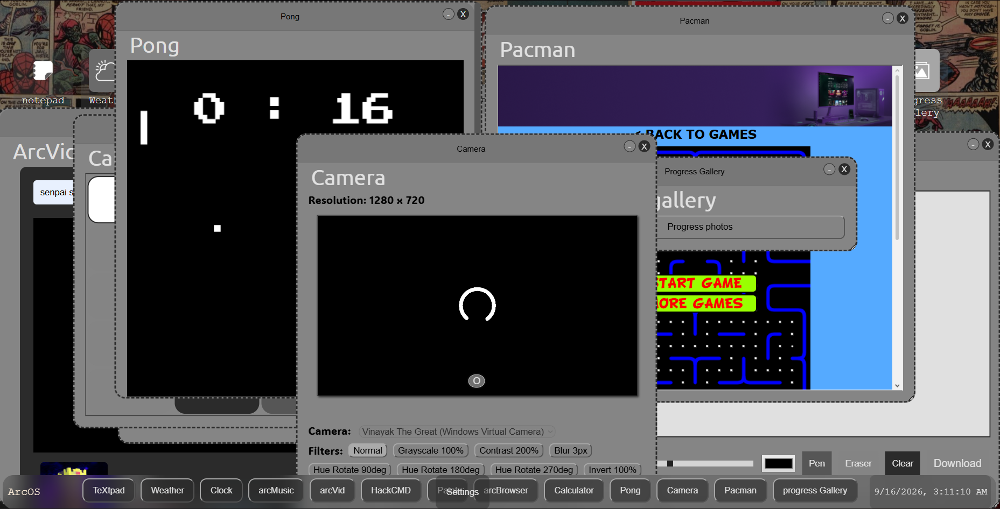

# WinterArcOS

so winter arc is coming and we need to pull a great comeback so i created this os to do wahtever i want on this like no other stop just here i'll be adding more and more features now we are looking like an decent OS like windows 8 i can say 

We have 11 apps rn

weather
video - yt
terminal
recorder - vn
pong - ping pong
paint
notepad
music
info
pacman
gallery
hackerterminal
clock
camera
calculator
App Store
Browser

and moreover you should check it on your own i suggest that

# Apps on which i'm working rn 

those aren't published 
FoodLog
Pomodoro
Focus
To-do
TimeTable
SchoolTracker
Workout Sessions!  

these are ideas idk how will i do them but will do it for sure

I hope you will like this it took me a long time, back pain, headache too complete this tbh!

Thank Yaa

# AI USE - 

Used For debugging, and creating camera filters cause i haven't really done that before